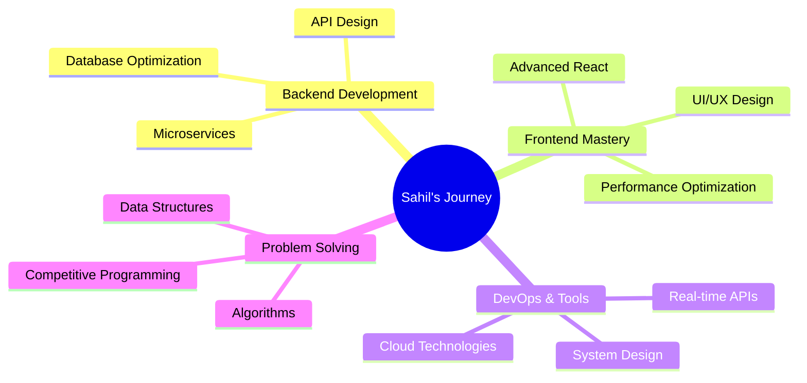

# <div align="center">🚀 **Sahil Ghorpade** | Software Developer & Problem Solver 🚀</div>

<div align="center">
  
[](https://git.io/typing-svg)

</div>

---

## 🎯 **About Me**


```javascript
const sahil = {
    pronouns: "He/Him",
    location: "Pimpri, Maharashtra, India",
    role: "Software Developer",
    education: "Electronics & Telecommunication Engineering",
    currentFocus: ["System Design", "Real-Time APIs", "Advanced React"],
    workExperience: "Software Engineering Intern @ Qualys",
    funFact: "I love turning complex problems into elegant solutions! 💡"
};
```

🔥 **Recent Achievement**: Completed Software Engineering Internship at **Qualys Security TechServices**  
🎯 **Experienced in**: Backend Microservices and Policy Compliance Systems  
🌱 **Currently Learning**: Advanced React, System Design, Real-Time APIs  

---

## 💼 **Professional Experience**

### 🏢 **Software Engineering Intern** | *Qualys Security TechServices Pvt. Ltd.*
**📅 April 2025 – June 2025**

<div align="left">
  
🔧 **Key Achievements:**
- Built **Policy Compliance Aggregator Service** - a scalable backend microservice
- Optimized search performance by creating advanced **index mappings**
- Mastered **Elasticsearch** & **OpenSearch** for large-scale data handling
- Improved compliance data retrieval efficiency by **40%+**

</div>

---

## 🛠️ **Tech Arsenal**

<div align="center">

### **Languages & Core Technologies**


### **Web Development**


### **Databases & Search**


### **Frameworks & Tools**


</div>

---

## 🚀 **Featured Projects**

<div align="center">

| 🏆 **Project** | 🛠️ **Tech Stack** | 🔗 **Description** |
|---|---|---|
| **🎥 VideoTube Backend** | Node.js, Express, MongoDB, JWT | Complete YouTube-like API with auth, video management, comments |
| **🗺️ React Leaflet Maps** | React.js, Leaflet.js | Interactive map visualization with real-time user interaction |
| **🍱 Meal Saver App** | MERN Stack | Smart meal tracking system to reduce food waste |
| **🗳️ Electronic Voting Machine** | 8051, Embedded C, Proteus | Secure voting system with LCD display and EEPROM storage |
| **🚿 Smart Irrigation** | Arduino, IoT, Sensors | Automated irrigation using moisture sensors |
| **☁️ Live Weather App** | React.js, OpenWeatherMap API | Real-time weather application with location-based forecasts |

</div>

---

## 📊 **GitHub Analytics**

<div align="center">
  


</div>

<div align="center">
  
[](https://git.io/streak-stats)

</div>

---

## 🏆 **GitHub Trophies**

<div align="center">
  
[](https://github.com/ryo-ma/github-profile-trophy)

</div>

---

## 🎯 **Current Focus Areas**



---

## 🌐 **Let's Connect & Collaborate!**

<div align="center">

[](https://www.linkedin.com/in/sahilghorpade27)
[](https://instagram.com/sahilghorpade27)
[](mailto:sahilpg27@gmail.com)
[](#)

**💬 Open to discussions about:** Software Development, System Design, Tech Innovations, and Career Opportunities!

</div>

---

## 💡 **Random Dev Wisdom**

<div align="center">
  


</div>

---

## 🎨 **Profile Activity**

<div align="center">


</div>

---

<div align="center">

### 🚀 **"Code is like humor. When you have to explain it, it's bad."** 🚀


**⭐ From [Sahil Ghorpade](https://github.com/sahilghorpade27) with ❤️**

</div>
